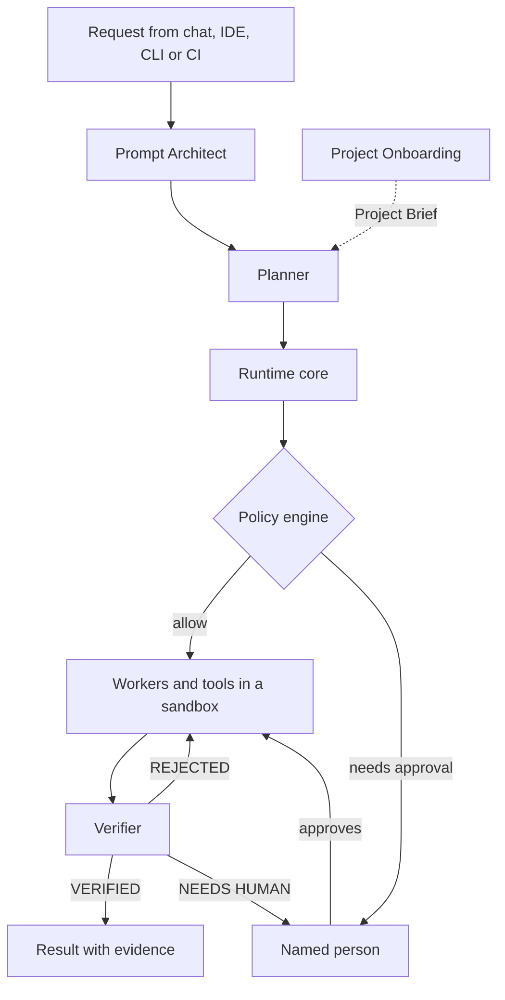
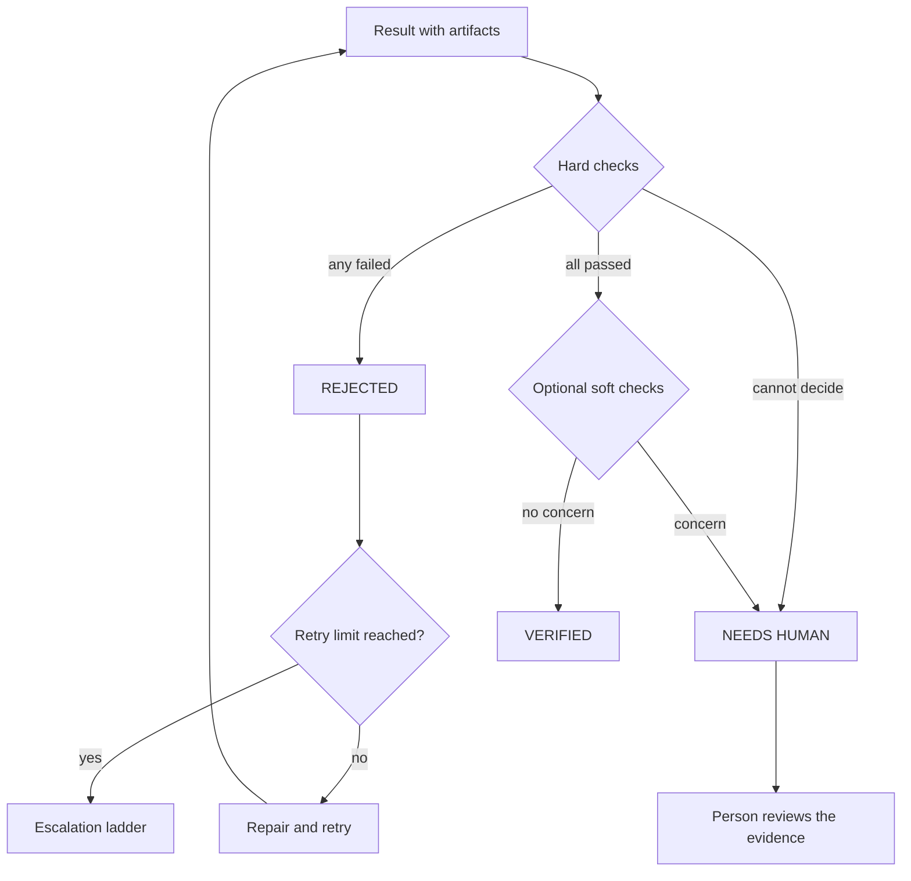
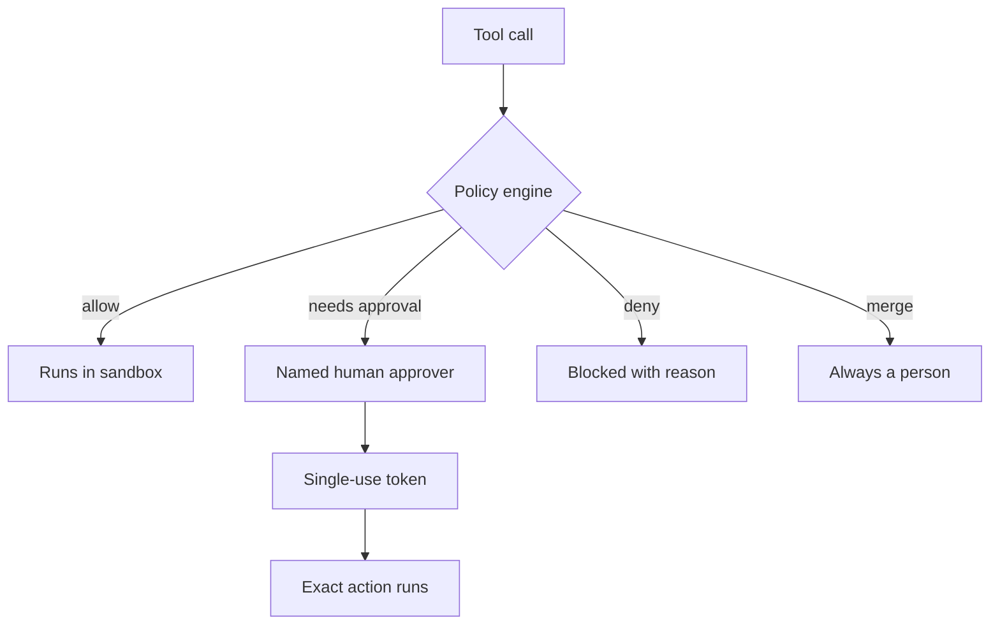
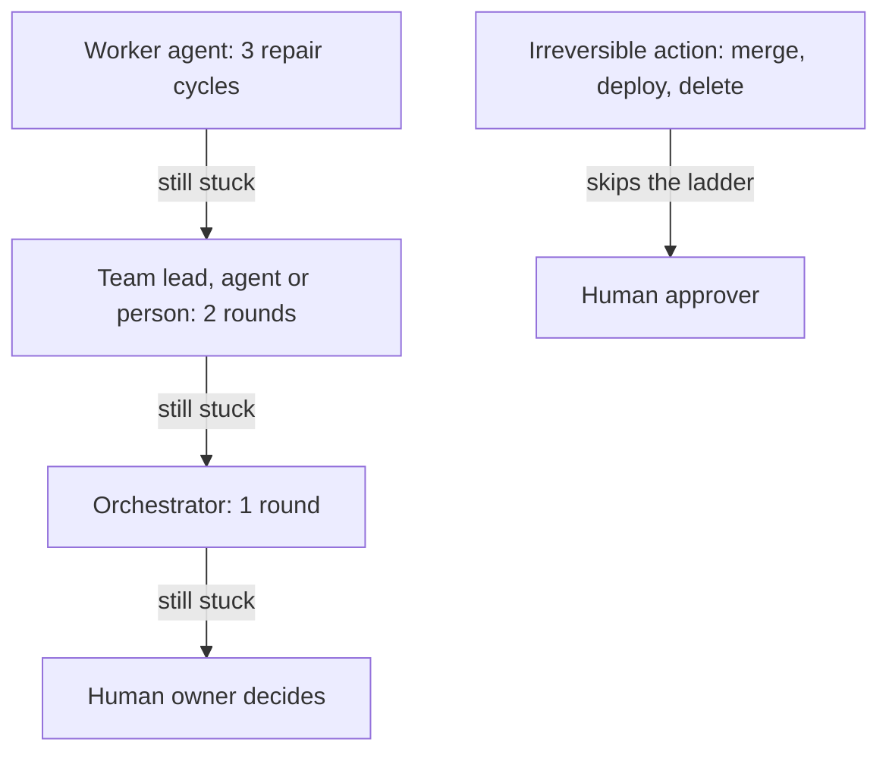
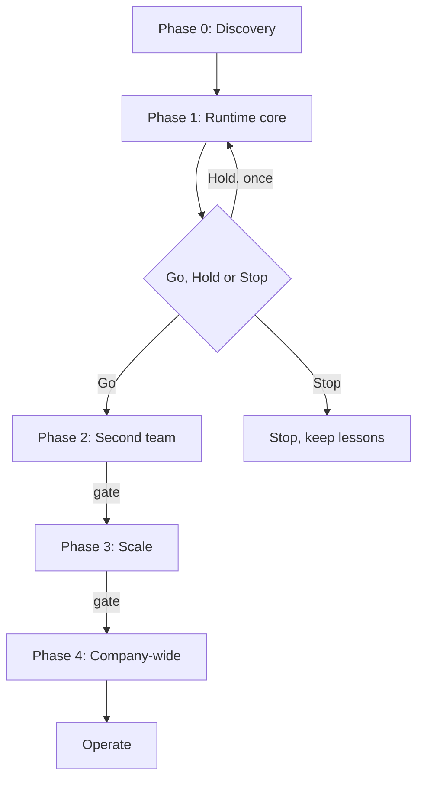

# Local Agentic AI Platform

A design for supervised AI agents that support every software delivery team, running on infrastructure the company controls.

> [!IMPORTANT]
> **Design stage. Documentation only, no implementation code yet.**
> This repository publishes **Project Book v2.0** (3 October 2026), which supersedes v1.0. Everything below describes what the platform is *designed* to do, not a running system.

[](#local-agentic-ai-platform)
[](CHANGELOG.md)
[](https://satyamchouksey-88.github.io/local-agentic-ai-platform/)
[](https://github.com/SatyamChouksey-88/local-agentic-ai-platform/commits/main)

**[Read online](https://satyamchouksey-88.github.io/local-agentic-ai-platform/)** ·
**[Download PDF](https://github.com/SatyamChouksey-88/local-agentic-ai-platform/releases/latest/download/Local-Agentic-AI-Platform-Project-Book-v2.0.pdf)** ·
**[Download DOCX](https://github.com/SatyamChouksey-88/local-agentic-ai-platform/releases/latest/download/Local-Agentic-AI-Platform-Project-Book-v2.0.docx)** ·
**[Reading guide](docs/DOCUMENTATION.md)** ·
**[Give feedback](https://github.com/SatyamChouksey-88/local-agentic-ai-platform/issues/new/choose)**

- **For:** every delivery team: Development, QA, BA and Product, Scrum and PM, DevOps and SRE, Security, and Documentation.
- **Core rule:** no result is accepted without evidence, and no irreversible action happens without a named person.
- **Runs on:** company-controlled infrastructure with open-weight models; cloud models only where policy allows.

**Contents:** [Why](#why-this-exists) · [What it is](#what-it-is-and-what-it-is-not) · [How it works](#how-it-works) · [Evidence](#trust-through-evidence) · [Safety](#safety-and-human-control) · [People and agents](#people-and-agents) · [Team Packs](#team-packs) · [Roadmap](#roadmap-phase-gates) · [Using this repo](#how-to-use-this-repository) · [Feedback](#feedback-and-contributing) · [Copyright](#copyright)

---

## Why this exists

Software delivery loses time in three places: repetitive, judgement-light work such as diagnosing red builds, writing boilerplate tests and drafting user stories; hand-offs and waiting between teams; and rework caused by unclear requirements and by output that turns out to be "almost right". AI tools speed up parts of that work, but people do not trust the output: in the Stack Overflow 2025 survey, 84% of developers use or plan to use AI while 46% distrust its accuracy (Verified, book Chapter 1).

The book proposes a governed way to let AI agents do supervised work across all teams, **prove every result**, and keep **humans in charge of anything irreversible**. The agents are supervised assistants, not autonomous employees.

## What it is, and what it is not

| It is | It is not |
|---|---|
| An orchestration and governance layer that makes AI agents useful and safe across teams | A new AI model: it uses existing open-weight models and, where policy allows, cloud models |
| A platform that works alongside the coding assistants teams already use, and that Copilot, Claude Code or Cursor can call through MCP | Another coding assistant |
| Supervised help for every delivery team, with a human lead in every team | A replacement for engineers: people own requirements, approvals and accountability |

The design has three layers:

| Layer | What it is |
|---|---|
| **Agent Runtime** (the product) | Platform agents, state machine, context engine, policy engine, model router, evidence Verifier, memory, tools, sandbox and audit |
| **Team Packs** (configuration) | Each team's roles, tools, permissions, policies, evidence validators, evaluation suite and named human owner |
| **Workflows** (visible value) | Concrete jobs such as CI failure diagnosis, PR review, story drafting and incident triage |

> [!NOTE]
> **Honest limits.** Agents are good at drafting and diagnosis but poor at certifying their own work. In one 2026 industrial study, an AI repair agent succeeded at the first attempt in only 10% of cases and sometimes weakened tests to look finished (Verified, single study). That is why every result is gated on evidence. For a single team, cloud AI services are usually cheaper than buying GPUs; running locally is a decision about control and data boundaries, not about saving money (Estimate).

<details>
<summary>What agents can and cannot do today (book Chapter 6)</summary>

| Can do now (proven elsewhere) | Will do (phased build) | Cannot do reliably today |
|---|---|---|
| Read a repository, run its build and tests, open a branch or PR | Supervised teams that plan, execute, verify and self-correct on bounded tasks | Replace an engineer end to end without supervision |
| Diagnose a failing build from logs and history | Brief every agent automatically when a project is connected | Own ambiguous requirements and decide what to build |
| Draft stories, code, tests, summaries and documentation for review | Structure every prompt and improve prompts against evaluations | Hold a large project's full context for months without drift |
| Route tasks to different models and log their cost | Run many teams and projects on one engine with isolation and budgets | Guarantee correctness or security without a human gate |
| Run models locally on one GPU | Evidence and approvals for every irreversible action | Catch its own error when two agents agree on a wrong answer |

</details>

<details>
<summary>Key terms</summary>

| Term | Meaning |
|---|---|
| CI | Continuous integration: the automatic build and test that runs on every code change |
| PR | Pull request: a proposed change that people review before it is merged |
| Open-weight model | An AI model that can be downloaded and run on the company's own servers |
| Evidence gating | Accepting work only with machine-checkable proof |
| MCP | Model Context Protocol: a standard way to connect AI agents and assistants to tools |
| Team Pack | A versioned bundle of configuration through which a team joins the platform |
| Project Brief | What the Project Onboarding agent learns about a project, written for every other agent |

The full glossary is in Appendix F of the book.

</details>

## How it works

Every request is designed to follow the same path: the Prompt Architect structures it, the Planner breaks it into steps, workers act only through a policy-checked tool gateway, and the Verifier decides from evidence whether the result is accepted.



| Component | Designed responsibility |
|---|---|
| Interfaces | Team chat, web console, IDE via MCP, CLI and CI hooks, all creating tasks through one API |
| Prompt Architect | Structures every request without changing its intent; asks, assumes or proceeds |
| Project Onboarding | Maps a project, runs its build and tests, and writes the Project Brief other agents use |
| Planner | Short, verifiable plans; marks steps that need approval |
| State machine and task store | Task states, checkpoints, retries, budgets, resume after failure |
| Context engine | The smallest high-signal context for each step within a token budget |
| Policy engine | Allow, deny or require approval for every tool call |
| Model router | Chooses plain code or a model per step; a privacy flag can block any route that leaves the company |
| Verifier | Decides the evidence status of each result with hard checks written in code |

Connecting a project is designed to take one CLI command and one configuration file in an `.agentic/` folder. Project Onboarding then maps the code, and MCP entries let Copilot, Claude Code, Cursor and VS Code call the platform. Removing it means deleting `.agentic/` and those entries; the project's code is unchanged. The target is a first useful result in under 15 minutes (book Chapter 37). The CLI is not published yet.

## Trust through evidence

The central design decision is that "done" is impossible without evidence. Agents are good drafters but unreliable judges of their own work, so the Verifier runs hard checks in plain code and never treats model confidence as a decision.



Evidence includes exit codes, test reports, traces, diffs against the base commit, cited log lines, repeat runs and source citations. The hard checks are: exit code 0 for every required command, N of N repeat runs passing (default five of five for test work), no reduction in assertion or check counts, a diff that touches only allowed paths, no secrets in outputs or diffs, budgets respected with no denied action attempted, and citations that exist and match their sources. Soft checks can only downgrade a result; they can never upgrade a failed hard check. Repair cycles default to three, and a Team Pack may set one to five (book Chapters 16 and 20).

## Safety and human control

Human approval is designed to be enforced by a policy engine in code, not by asking a model to be careful. Content read from repositories, tickets or the web is treated as data, never as instructions.



| Default decision | Examples (book Chapter 21) |
|---|---|
| **Allow** | Read repository files, write inside the sandbox, run builds and tests in the sandbox |
| **Needs approval** | Push a branch, open a PR, edit tickets, deploy, delete outside the sandbox, message outside the team |
| **Always human** | Merge |
| **Always deny** | Read secrets, network outside the allow-list, payments or purchases |

No setting can turn the denial of secrets or payments into an allow. Unanswered approvals expire; nothing is ever auto-approved. An emergency stop is designed per project, per team and globally.

### Where data may go

| Project classification | Local models | Approved cloud models |
|---|---|---|
| Public | Yes | Yes |
| Internal | Yes | Only if the project opts in, with a data-processing agreement and no training on the company's data; off by default |
| Confidential | Yes | No |
| Restricted | Yes | Never; dedicated model instances if required |

Confidential and restricted work stays on company-controlled infrastructure (book Chapter 24).

## People and agents

Every team always has a human lead. Each seat in a team is filled by an agent, by a person, or by a person assisted by an agent, and the choice can change per project without touching the runtime. Agents and people post short updates in each task's thread with links to evidence, and people can step in at any time: mention an agent, change a priority, reassign a seat, take over a task or type "stop" (book Chapter 8).

When an agent is stuck, it asks for help the way people do, one level at a time:



Each step receives an escalation packet: goal, what was tried, evidence, blocker, options and a recommendation. Suspected prompt injection or data leakage, attempts to work around a policy denial, and anything involving personal data also go straight to a person. If nobody responds, the task pauses; it is never auto-approved (book Chapter 22).

## Team Packs

A Team Pack is a versioned, signed bundle of configuration (roles, skills, prompts, connectors, validators, evaluations and a named owner). Adding a team is designed to mean writing configuration and evaluations, not rebuilding the platform.

| Team | First workflows | Phase |
|---|---|---|
| Delivery core (shared) | CI and build failure diagnosis | 1 |
| Development | PR review assistant, bug diagnosis, small fixes | 2 |
| QA | Test design, test generation and repair, flaky-test triage | 2 |
| BA and Product | Requirement to user stories and acceptance criteria | 3 (demo in 1) |
| Scrum and PM | Sprint summary, blocker digest, grooming suggestions | 3 |
| DevOps and SRE | Pipeline and incident triage, runbook suggestions | 3 |
| Security | Dependency, vulnerability and secret-scan triage | 3 |
| Documentation | Doc freshness, release notes, how-to drafts | 4 |
| Optional: HR, Finance, Sales | Policy Q&A, RFP first drafts and similar | 4+, after legal review |

The catalogue lists 19 roles as a menu, not a staffing plan. Six are active in Phase 1: four model-based roles (Prompt Architect, Project Onboarding, Planner and the shared Failure Analyst), the code-based Verifier, and one demo role, the Requirements Analyst, for the second team's workflow (book Chapters 8 and 32).

<details>
<summary>The 19 roles at a glance (book Chapter 32)</summary>

| Role | Group | What it does | Default seat | Phase |
|---|---|---|---|---|
| Orchestrator | Platform | Routes work across teams, budgets, cross-team escalation | Agent (rules first) | 3 |
| Prompt Architect | Platform | Structures every request; ask, assume or proceed | Agent | 1 |
| Project Onboarding | Platform | Reads the project; writes the Project Brief and briefings | Agent | 1 |
| Planner | Platform | Short verifiable plans; single or multi-agent decision | Agent | 1 |
| Verifier | Platform | Evidence status; hard checks in code | Code plus agent | 1 |
| Failure Analyst | Delivery core | Diagnoses failed pipelines, builds and tests | Agent | 1 |
| Test Designer | QA | Test cases from acceptance criteria | Agent, human reviews | 2 |
| Automation Engineer | QA | Automated tests in the project's framework | Agent | 2 |
| QA Lead | QA | Coordinates QA work; coverage and reports | Human assisted by agent | 2 |
| Dev Lead | Development | Splits work into small tasks; PR summaries | Human assisted by agent | 2 |
| Architect | Development | Design options, ADR drafts, licence checks | Human assisted by agent | 2 |
| Backend Developer | Development | Server-side tasks with tests | Agent | 2 |
| Frontend Developer | Development | UI tasks with tests and accessibility checks | Agent | 2 |
| Code Reviewer | Development | Evidence-backed review; recommends only | Agent | 2 |
| Requirements Analyst | BA and Product | User stories and acceptance criteria with citations | Agent, BA decides | 3 (demo in 1) |
| Scrum Master assistant | Scrum and PM | Digests, sprint summaries, grooming drafts | Agent, Scrum Master decides | 3 |
| DevOps and SRE Lead | DevOps and SRE | Pipeline and incident triage; change drafts with rollback | Human assisted by agent | 3 |
| Security Analyst | Security | Vulnerability and secret-scan triage; fix proposals | Agent, security decides | 3 |
| Technical Writer | Documentation | Doc freshness, release notes, drafts from code | Agent | 4 |

</details>

## Roadmap: phase gates

The plan uses gates with exit criteria, not calendar dates. Only Phases 0 and 1 are requested for approval now.



| Phase | Goal | Exit gate |
|---|---|---|
| 0. Discovery | Decide the stack, measure baselines | Stack chosen; baselines measured on at least two projects |
| 1. Runtime core | Prove the engine on CI failure diagnosis, plus a BA demo | Go criteria met |
| 2. Second team | Dev and QA packs; harden for daily use | Two teams use it weekly; evidence on 100% of results |
| 3. Scale | More teams and projects | Parallel projects with no data mixing |
| 4. Company-wide | Rollout and self-service | Steering group signs off rollout |

Phase 1's first workflow is CI and build failure diagnosis, a problem that Dev, QA and DevOps all share: it is read-mostly, low-risk and measurable. A second team's workflow (requirement to user stories) then runs on the same runtime by changing configuration only, which is the proof that the platform works for more than one team.

**Phase 1 Go criteria** (book Chapter 49): diagnosis agreement at least 75%, at least 30% faster than baseline, evidence on 100% of results, zero policy bypasses, usefulness at least 60%, and cost within budget. Any policy bypass or data leak means Stop.

Phases 0 and 1 are estimated at about 18 to 29 person-weeks of effort (Estimate). Hardware starts on an existing workstation or a rented cloud GPU; buying waits for a Go decision.

## How to use this repository

There is nothing to install. Read the book online or download it from the [latest release](https://github.com/SatyamChouksey-88/local-agentic-ai-platform/releases/latest), and use the [reading guide](docs/DOCUMENTATION.md) to find the chapters for your role.

<details>
<summary>Reading paths by role</summary>

| Reader | Read these parts | Time |
|---|---|---|
| Leadership | Chapter 1, then Chapters 48 to 50, 54 and 58 | 15 to 20 minutes |
| Team leads | Part B, plus your Team Pack in Chapters 9 and 33 | 30 minutes |
| Architects and engineers | Parts C, D and E | 2 hours |
| Infrastructure and finance | Part F and Chapter 50 | 30 minutes |
| Security and compliance | Section 18.7 and Chapters 21, 25 to 28, 30 and 55 | 30 minutes |

</details>

<details>
<summary>Target technology stack (recommended in the book, not built)</summary>

| Layer | Recommendation |
|---|---|
| Core runtime | Python 3.12+, LangGraph, Pydantic |
| API | FastAPI |
| Model serving | Ollama for small setups; vLLM for shared servers |
| Model gateway | LiteLLM with routing rules |
| Database and retrieval | PostgreSQL with pgvector (SQLite with sqlite-vec for single-user setups) |
| Cache and queue | Valkey |
| Durable execution | LangGraph checkpoints; Temporal only if a Phase 0 spike shows clear benefit |
| Sandbox | Docker with gVisor |
| Tracing and prompt registry | Langfuse (self-hosted) and OpenTelemetry |
| Evaluation and red teaming | promptfoo, garak, PyRIT, AgentDojo |
| Console and CLI | TypeScript; React with Next.js for the console |
| Tools and IDE integration | MCP |
| Policy | YAML rules as code; OPA or Cedar optional |
| Secrets | HashiCorp Vault or OpenBao |

See book Chapter 35 for the alternatives considered.

</details>

### Claim labels

The book labels its figures so readers know how much to rely on them:

| Label | Meaning |
|---|---|
| **Verified** | Checked against a primary source, or two or more consistent reputable sources |
| **Estimate** | The author's own calculation, design target or interpretation |
| **Unverified** | A single secondary source, or conflicting data; confirm before relying on it |

Claims also carry their origin: [R1], [R2] or [R3] for the three research rounds, or [New in 2.0] for design added in this version. Prices and benchmarks change quickly; re-check them before external use. The book is not legal advice.

### Repository layout

```text
.
├── README.md
├── CHANGELOG.md
├── CONTRIBUTING.md
├── SECURITY.md
├── AGENTS.md                                        # Rules for AI assistants editing this repo
├── docs/
│   ├── index.html                                   # GitHub Pages landing page
│   ├── DOCUMENTATION.md                             # Reading guide and contents
│   ├── Local-Agentic-AI-Platform-Project-Book-v2.0.pdf
│   └── Local-Agentic-AI-Platform-Project-Book-v2.0.docx
└── .github/
    ├── ISSUE_TEMPLATE/                              # Feedback and question forms
    ├── PULL_REQUEST_TEMPLATE.md
    └── workflows/pages.yml                          # Deploys docs/ to GitHub Pages
```

## Feedback and contributing

Design feedback is welcome through the [issue forms](https://github.com/SatyamChouksey-88/local-agentic-ai-platform/issues/new/choose). Please name the chapter or section. For changes to the documentation, see [CONTRIBUTING.md](CONTRIBUTING.md). To report something that should not be public, use [private reporting](SECURITY.md).

## Copyright

Copyright © 2026 Satyam Chouksey. All rights reserved.

This repository is public so the design can be read and discussed. No licence is granted to reproduce, redistribute or create derivative works from the Project Book without the author's written permission.

## Author

[Satyam Chouksey](https://github.com/SatyamChouksey-88)
