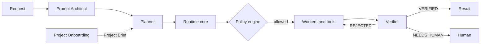
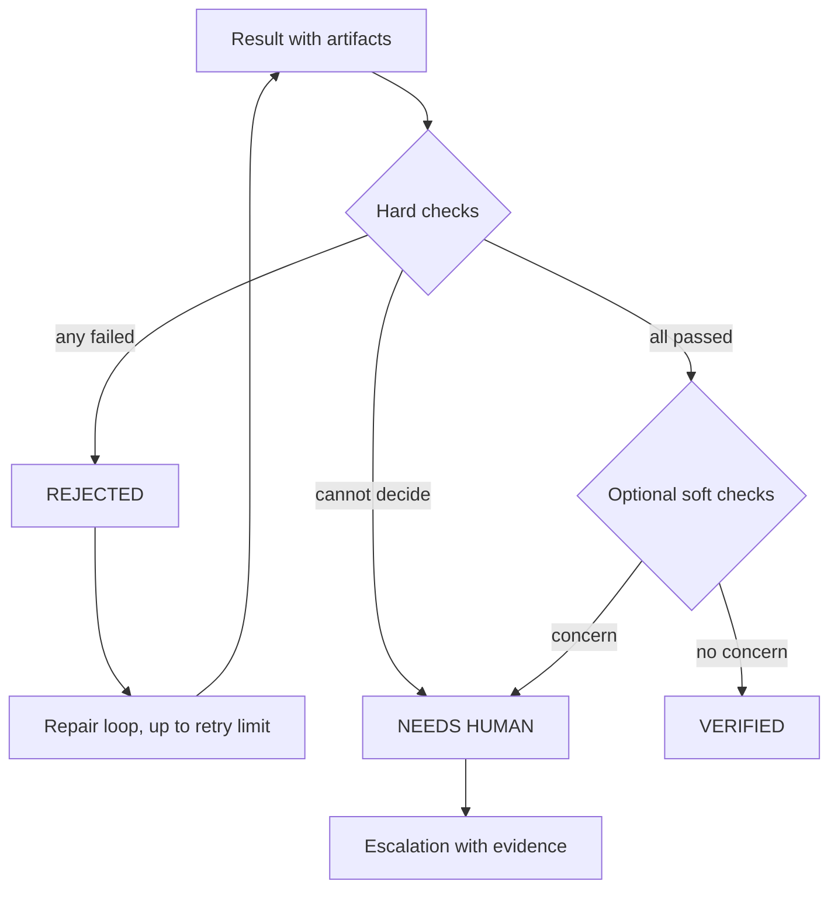
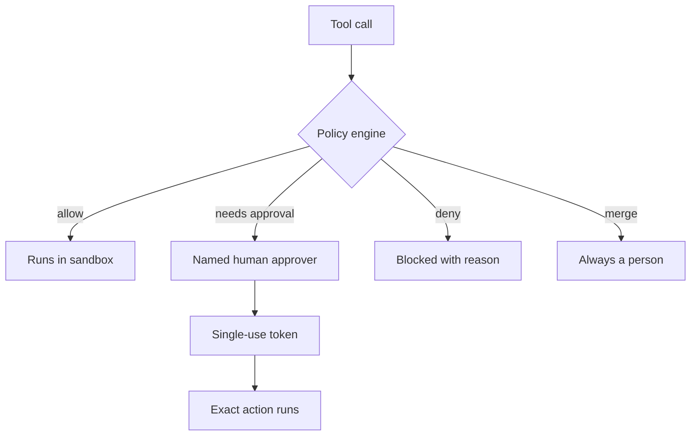
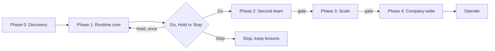

# Local Agentic AI Platform

A design for supervised AI agents that support every software delivery team, running on infrastructure the company controls.

> [!IMPORTANT]
> **Design stage. Documentation only, no implementation code yet.**
> This repository publishes **Project Book v2.0** (3 October 2026), which supersedes v1.0. Everything below describes what the platform is *designed* to do, not a running system.

[](#local-agentic-ai-platform)
[](CHANGELOG.md)
[](https://satyamchouksey-88.github.io/local-agentic-ai-platform/)
[](https://github.com/SatyamChouksey-88/local-agentic-ai-platform/commits/main)

**[Read online](https://satyamchouksey-88.github.io/local-agentic-ai-platform/)** ·
**[Download PDF](https://github.com/SatyamChouksey-88/local-agentic-ai-platform/releases/latest/download/Local-Agentic-AI-Platform-Project-Book-v2.0.pdf)** ·
**[Download DOCX](https://github.com/SatyamChouksey-88/local-agentic-ai-platform/releases/latest/download/Local-Agentic-AI-Platform-Project-Book-v2.0.docx)** ·
**[Reading guide](docs/DOCUMENTATION.md)** ·
**[Give feedback](https://github.com/SatyamChouksey-88/local-agentic-ai-platform/issues/new/choose)**

**Contents:** [Why](#why-this-exists) · [How it works](#how-it-works) · [Evidence](#trust-through-evidence) · [Safety](#safety-and-human-control) · [Team Packs](#team-packs) · [Roadmap](#roadmap-phase-gates) · [Using this repo](#how-to-use-this-repository) · [Feedback](#feedback-and-contributing) · [Copyright](#copyright)

---

## Why this exists

Delivery teams lose time on repetitive work (red builds, boilerplate tests, story drafting, status reports), on hand-offs between teams, and on rework from output that is "almost right". AI tools speed up parts of that work, but people do not trust the output: in the Stack Overflow 2025 survey, 84% of developers use or plan to use AI while 46% distrust its accuracy (Verified, book Chapter 3).

The book proposes a governed way to let AI agents do supervised work across all teams, **prove every result**, and keep **humans in charge of anything irreversible**. The agents are supervised assistants, not autonomous employees.

The design has three layers:

| Layer | What it is |
|---|---|
| **Agent Runtime** (the product) | Platform agents, state machine, context engine, policy engine, model router, evidence Verifier, memory, tools, sandbox and audit |
| **Team Packs** (configuration) | Each team's roles, tools, permissions, policies, evidence validators, evaluation suite and named human owner |
| **Workflows** (visible value) | Concrete jobs such as CI failure diagnosis, PR review, story drafting and incident triage |

## How it works

Every request is designed to follow the same path: the Prompt Architect structures it, the Planner breaks it into steps, workers act only through a policy-checked tool gateway, and the Verifier decides from evidence whether the result is accepted.



| Component | Designed responsibility |
|---|---|
| Interfaces | Team chat, web console, IDE via MCP, CLI and CI hooks, all creating tasks through one API |
| Prompt Architect | Structures every request without changing its intent; asks, assumes or proceeds |
| Project Onboarding | Maps a project, runs its build and tests, and writes the Project Brief other agents use |
| Planner | Short, verifiable plans; marks steps that need approval |
| State machine and task store | Task states, checkpoints, retries, budgets, resume after failure |
| Context engine | The smallest high-signal context for each step within a token budget |
| Policy engine | Allow, deny or require approval for every tool call |
| Model router | Chooses plain code or a model per step; a privacy flag can block any route that leaves the company |
| Verifier | Decides the evidence status of each result with hard checks written in code |

## Trust through evidence

The central design decision is that "done" is impossible without evidence. Agents are good drafters but unreliable judges of their own work, so the Verifier runs hard checks in plain code and never treats model confidence as a decision.



Evidence includes exit codes, test reports, traces, diffs against the base commit, cited log lines, repeat runs (default five of five for test work) and source citations. Hard checks include: no reduced assertion counts, diffs only in allowed paths, and no secrets in outputs. Soft checks can only downgrade a result; they can never upgrade a failed hard check (book Chapter 20).

## Safety and human control

Human approval is designed to be enforced by a policy engine in code, not by asking a model to be careful. Content read from repositories, tickets or the web is treated as data, never as instructions.



| Default decision | Examples (book Chapter 21) |
|---|---|
| **Allow** | Read repository files, write inside the sandbox, run builds and tests in the sandbox |
| **Needs approval** | Push a branch, open a PR, edit tickets, deploy, delete outside the sandbox, message outside the team |
| **Always human** | Merge |
| **Always deny** | Read secrets, network outside the allow-list, payments or purchases |

No setting can turn the denial of secrets or payments into an allow. Unanswered approvals expire; nothing is ever auto-approved. An emergency stop is designed per project, per team and globally.

## Team Packs

A Team Pack is a versioned, signed bundle of configuration (roles, skills, prompts, connectors, validators, evaluations and a named owner). Adding a team is designed to mean writing configuration and evaluations, not rebuilding the platform.

| Team | First workflows | Phase |
|---|---|---|
| Delivery core (shared) | CI and build failure diagnosis | 1 |
| Development | PR review assistant, bug diagnosis, small fixes | 2 |
| QA | Test design, test generation and repair, flaky-test triage | 2 |
| BA and Product | Requirement to user stories and acceptance criteria | 3 (demo in 1) |
| Scrum and PM | Sprint summary, blocker digest, grooming suggestions | 3 |
| DevOps and SRE | Pipeline and incident triage, runbook suggestions | 3 |
| Security | Dependency, vulnerability and secret-scan triage | 3 |
| Documentation | Doc freshness, release notes, how-to drafts | 4 |

The book's agent catalogue lists 19 roles as a menu, not a staffing plan. Phase 1 runs four model-based roles (Prompt Architect, Project Onboarding, Planner, Failure Analyst) plus the code-based Verifier (book Chapters 9 and 32).

## Roadmap: phase gates

The plan uses gates with exit criteria, not calendar dates. Only Phases 0 and 1 are requested for approval now.



| Phase | Goal | Exit gate |
|---|---|---|
| 0. Discovery | Decide the stack, measure baselines | Stack chosen; baselines measured on at least two projects |
| 1. Runtime core | Prove the engine on CI failure diagnosis, plus a BA demo | Go criteria met |
| 2. Second team | Dev and QA packs; harden for daily use | Two teams use it weekly; evidence on 100% of results |
| 3. Scale | More teams and projects | Parallel projects with no data mixing |
| 4. Company-wide | Rollout and self-service | Steering group signs off rollout |

**Phase 1 Go criteria** (book Chapter 49): diagnosis agreement at least 75%, at least 30% faster than baseline, evidence on 100% of results, zero policy bypasses, usefulness at least 60%, and cost within budget. Any policy bypass or data leak means Stop.

Phases 0 and 1 are estimated at about 18 to 29 person-weeks over about four months (Estimate).

## How to use this repository

There is nothing to install. Read the book online or download it from the [latest release](https://github.com/SatyamChouksey-88/local-agentic-ai-platform/releases/latest), and use the [reading guide](docs/DOCUMENTATION.md) to find the chapters for your role.

<details>
<summary>Reading paths by role</summary>

| Reader | Read these parts | Time |
|---|---|---|
| Leadership | Chapter 1, then Chapters 48 to 50, 54 and 58 | 15 to 20 minutes |
| Team leads | Part B, plus your Team Pack in Chapters 9 and 33 | 30 minutes |
| Architects and engineers | Parts C, D and E | 2 hours |
| Infrastructure and finance | Part F and Chapter 50 | 30 minutes |
| Security and compliance | Section 18.7 and Chapters 21, 25 to 28, 30 and 55 | 30 minutes |

</details>

<details>
<summary>Target technology stack (recommended in the book, not built)</summary>

| Layer | Recommendation |
|---|---|
| Core runtime | Python 3.12+, LangGraph, Pydantic |
| API | FastAPI |
| Console, CLI and IDE integration | TypeScript |
| Task state | Postgres checkpointer for LangGraph |
| Model gateway | LiteLLM with routing rules |
| Policy | YAML rules as code; OPA or Cedar optional |

See book Chapter 35 for the alternatives considered.

</details>

### Claim labels

The book labels its figures so readers know how much to rely on them:

| Label | Meaning |
|---|---|
| **Verified** | Checked against a primary source, or two or more consistent reputable sources |
| **Estimate** | The author's own calculation, design target or interpretation |
| **Unverified** | A single secondary source, or conflicting data; confirm before relying on it |

Prices and benchmarks change quickly; re-check them before external use. The book is not legal advice.

### Repository layout

```text
.
├── README.md
├── CHANGELOG.md
├── CONTRIBUTING.md
├── SECURITY.md
├── AGENTS.md
├── docs/
│   ├── index.html                                   # GitHub Pages landing page
│   ├── DOCUMENTATION.md                             # Reading guide and contents
│   ├── Local-Agentic-AI-Platform-Project-Book-v2.0.pdf
│   └── Local-Agentic-AI-Platform-Project-Book-v2.0.docx
└── .github/
    ├── ISSUE_TEMPLATE/                              # Feedback and question forms
    ├── PULL_REQUEST_TEMPLATE.md
    └── workflows/pages.yml                          # Deploys docs/ to GitHub Pages
```

## Feedback and contributing

Design feedback is welcome through the [issue forms](https://github.com/SatyamChouksey-88/local-agentic-ai-platform/issues/new/choose). For changes to the documentation, see [CONTRIBUTING.md](CONTRIBUTING.md).

## Copyright

Copyright © 2026 Satyam Chouksey. All rights reserved.

This repository is public so the design can be read and discussed. No licence is granted to reproduce, redistribute or create derivative works from the Project Book without the author's written permission.

## Author

[Satyam Chouksey](https://github.com/SatyamChouksey-88)
